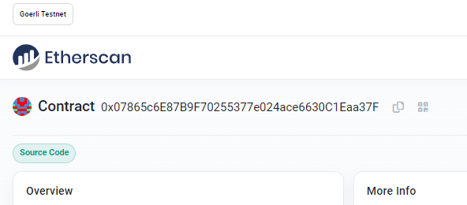
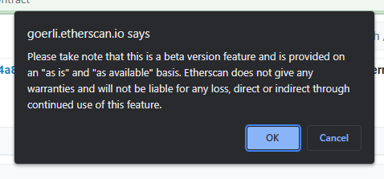
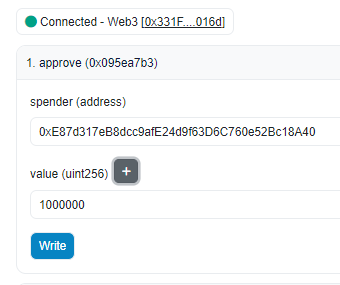
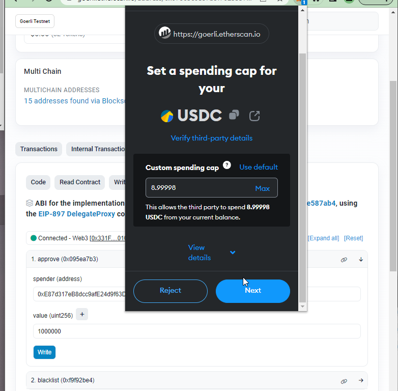
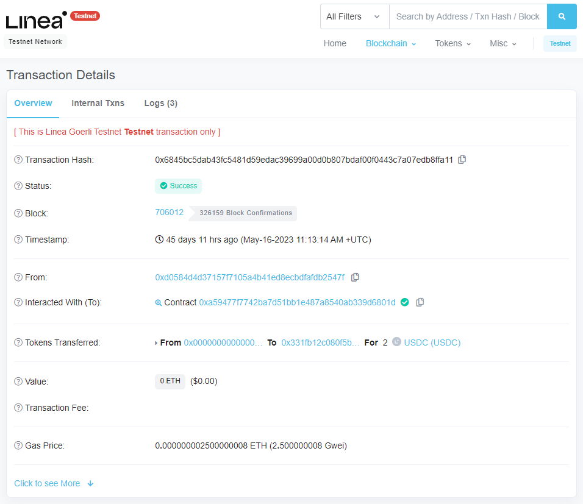

# Introduction

## What is this?

This is a guide for using a crypto-asset bridge, which bridges only USDC between networks: initially, between the [Goerli Ethereum Testnet](https://goerli.net/) and the [Linea Goerli Testnet](https://linea.build/).

> This bridge **does not have a frontend**. You can interact with it through a block explorer, or you could build your own frontend or other app for it.

## What does it do?

USDC is minted natively on each network on which the currency is available. Therefore, this could be considered a “burn and mint” bridge: the USDC submitted for bridging on the chain of origin is burned, and the equivalent amount of USDC is minted on Linea.

> **Currently, as Linea is still in public beta testnet, the origin end of the bridge is on Goerli, and the destination end of the bridge is on Linea Goerli.** In other words, this bridge moves **test USDC** back and forth between Linea Goerli and the Goerli testnet, through a mechanism of burning and minting.

## How do I bridge USDC with this?

**This bridge is not intended for everyday end users wishing to move USDC between networks.**

If you’re looking for that service, check out the bridges that have [already been deployed](./../bridge-funds/) for that purpose.

**This bridge can be used through writing a program that interacts with it–this is the method we recommend.**

If you need to use this bridge and cannot write your own dapp to use it, you can bridge USDC from Goerli to Linea, and from Linea to Goerli, by using certain tools on Etherscan.

### Can I use this bridge on another network?

The code for this bridge is open-source; it will be released under the Apache 2.0 license; if you're interested in this use case, watch this space for future documentation on the topic.

# Bridging USDC between Goerli and Linea Goerli

## Requirements and process

We’ll walk through these steps in more detail below, but this is the general process:

1.  Have Goerli or Linea USDC available to you in an account that you control
2.  Have sufficient gETH or Linea ETH in that account to be able to pay gas fees

        **Note: Currently, the bridge requires users to pay a 0.01ETH fee, to help prevent denial-of-service attacks. This amount–or higher–must be sent as the value of the transaction.**

3.  Have **the addresses below ready** and available to use
4.  Grant the USDC Bridge an approval to transfer USDC on your behalf
5.  Formulate the transaction in an environment that has access to your wallet or private key
6.  Execute either the `deposit` or `depositTo` functions with the following parameters:
    1. `deposit` (needs to be at least .01)
    2. `amount` (of USDC to send)
    3. `to` (destination address - only needed for `depositTo`)

### Current addresses:

```
    {
      "goerli": {
        "L1MessageBridge": "0xE87d317eB8dcc9afE24d9f63D6C760e52Bc18A40",
        "FiatTokenV2_1": "0x07865c6e87b9f70255377e024ace6630c1eaa37f",
        "L1USDCBridge": "0x9c556D2cCfb6157E4A6305aa9963EdD6ca5047cB"
      },
      "goerliLinea": {
        "L2MessageBridge": "0xA59477f7742Ba7d51bb1E487a8540aB339d6801d",
        "FiatTokenV2_1": "0xf56dc6695cF1f5c364eDEbC7Dc7077ac9B586068",
        "L2USDCBridge": "0x2aeD4D02fD76EeC1580cCDbA158b16F4A0Ad2B60"
      }
    }
```

# Detailed Walkthrough

In order to grant the allowances and formulate the transactions required for this, we’ll be using "universal dapp" functionality built into block explorers. This refers to the block explorer being able to recognize functions present in smart contracts, and programmatically render user interfaces that allow users to interact with those functions. The instructions below should get you through the process, but if you want to know more, Etherscan’s intro article on their version of the feature is [here](https://info.etherscan.com/how-to-use-read-or-write-contract-features-on-etherscan/).

_This assumes you have steps 1-3 above taken care of._

## Goerli to Linea Goerli

### 4. Granting the message bridge approval to spend your USDC

Somehow, the message has to get from Goerli to Linea Goerli that you’ve burnt tokens on this end, and that corresponding tokens should be minted on the other end, right? This is the part where we enable that to happen.



Go to the Goerli USDC contract [on Etherscan](https://goerli.etherscan.io/address/0x07865c6e87b9f70255377e024ace6630c1eaa37f): [https://goerli.etherscan.io/address/0x07865c6e87b9f70255377e024ace6630c1eaa37f](https://goerli.etherscan.io/address/0x07865c6e87b9f70255377e024ace6630c1eaa37f)

Now click on that button with the little blue-green checkmark, labelled “Contract”:


There are a number of views nested under “Contract”; for our purposes, we’re looking for the “Write as Proxy” tab:


Click on that red `Connect to Web3` button.

A disclaimer is offered; if this worries you, you should consider building your own dapp to interface with this contract.



Etherscan offers a number of options to connect; we’ll be using MetaMask. Connecting takes a few clicks:


Now Etherscan knows the public address of the account we’ve connected. Next, click on that `approve` contract function:



There are two fields to fill in here. First, **the ‘spender’ field should be filled with the address of the Linea message bridge** on Goerli: `0xE87d317eB8dcc9afE24d9f63D6C760e52Bc18A40`

> ** It should _not_ have your address; what you are doing here is granting the message bridge a _token approval_ to use USDC on your behalf.**

Second, the value. Press that `+` button and choose the first option, ten to the sixth power, and click add:


**This is important, and you should only choose a different option if you know what you’re doing.**

This has to do with the “token decimals”--in other words, how many decimal points of precision one can use when calculating amounts of the token. Normally, you can find them on the contract page on Etherscan; at the time of writing, they weren’t posted on the Goerli USDC contract yet, but [here they are on mainnet Ethereum](https://etherscan.io/token/0xa0b86991c6218b36c1d19d4a2e9eb0ce3606eb48):


We’ll see this again in a moment, but it bears repeating: This means that **in order to represent the value of 1USDC, you would need to type 1 plus six zeroes: 1000000**. If you want to understand the technical underpinnings of this, there’s no better source than [EIP-20](https://eips.ethereum.org/EIPS/eip-20).

For now, click on the `Write` button and approve the transaction; if you’re using MetaMask, you’ll have an additional option to impose a spending cap:



Once you’ve confirmed that transaction, and it’s written to chain, you’re ready for the next step: **generating the transaction and actually sending your USDC to Linea.**

### 5. Generating the transaction

This process will be similar to the one we already went through, so it should be straightforward.

Head to the `L1USDCBridge` address on Goerli Etherscan: [https://goerli.etherscan.io/address/0x9c556D2cCfb6157E4A6305aa9963EdD6ca5047cB](https://goerli.etherscan.io/address/0x9c556D2cCfb6157E4A6305aa9963EdD6ca5047cB)

- Again, click on `Contract`, and then on `Write as Proxy`.
- Connect your wallet as we did before.
- You have two choices when it comes to functions:
  - `deposit - `take your connected account’s USDC deposit, burn it, and mint the corresponding amount **to the same address on Goerli Linea.**
  - `depositTo - `performs the same burn-and-mint process, but gives you the opportunity to **specify a target address on Goerli Linea**.

We’ll use the deposit function for this example.

- Enter a **deposit amount** (remember; **it needs to be at least .01**, in order to cover the DoS prevention gas cost)
- Enter the **amount of USDC** you wish to transfer, plus six zeroes. If this is confusing, see the section above regarding token decimals. In the example below, we’re sending 2 USDC.


### 6. Execute the function and confirm your transaction

- Hit the `Write` button, and approve the resulting transaction:


[Here’s](https://goerli.etherscan.io/tx/0xec1835c764c6845c5acf672bd5b2e69f6c0a08c1891daa73974205c3f2c891bd) what the result of that transaction looks like on chain:


From here, the transaction will be relayed by the Message Bridge to Linea’s coordination and sequencing system, and it may not be immediate; under heavy traffic, at time of writing, it took ten minutes. [This was the resulting token mint transaction](https://goerli.lineascan.build/tx/0x6845bc5dab43fc5481d59edac39699a00d0b807bdaf00f0443c7a07edb8ffa11), delivered straight to the same address on Linea, just as expected:



Congratulations; you just bridged tokens to a zero knowledge-enabled Layer 2 network using a universal dapp. 🤯😎🚀

## Linea Goerli to Goerli

Many will know the saying, “Replacement is the reverse of removal” -- and in this case, it's essentially true, with a few minor UI differences on the Linea side of things. The steps are as follows:

### Granting the L2 message bridge approval to spend your USDC

- Again, head to the USDC contract, this time on Linea; [here's a link to the "write as proxy" function](https://goerli.lineascan.build/address/0xf56dc6695cf1f5c364edebc7dc7077ac9b586068#writeProxyContract).

**The UI does look a little different here**, but it's the same functionality:


- Connect to MetaMask by clicking the 'Connect to Web3' button
- Approve the contract in MetaMask
- Fill out the values in the contract
  - The Linea Goerli bridge contract, as indicated above, is `0xA59477f7742Ba7d51bb1E487a8540aB339d6801d`.

**There is a difference here; you won't have to choose the exponents for your decimals.** Just type in the value you're transferring plus six zeroes.


- Smash that `Write` button

### 5. Generating the transaction

This time, we're heading to the L2 end of the bridge: [https://goerli.lineascan.build/address/0xa59477f7742ba7d51bb1e487a8540ab339d6801d](https://goerli.lineascan.build/address/0xa59477f7742ba7d51bb1e487a8540ab339d6801d)

- Once more, click on `Contract`, and then on `Write as Proxy`.
- Connect your friendly, foxy wallet
- Choose your delivery method; as a refresher:
  - `deposit - `take your connected account’s USDC deposit, burn it, and mint the corresponding amount **to the same address on Goerli.**
  - `depositTo - `performs the same burn-and-mint process, but gives you the opportunity to **specify a target address on Goerli**.

### 6. Execute the function and confirm your transaction

- Hit the `Write` button, and approve the resulting transaction
- Wait for the transaction to land on the destination chain

And now, your tokens have come back down to the terra firma of L1.
