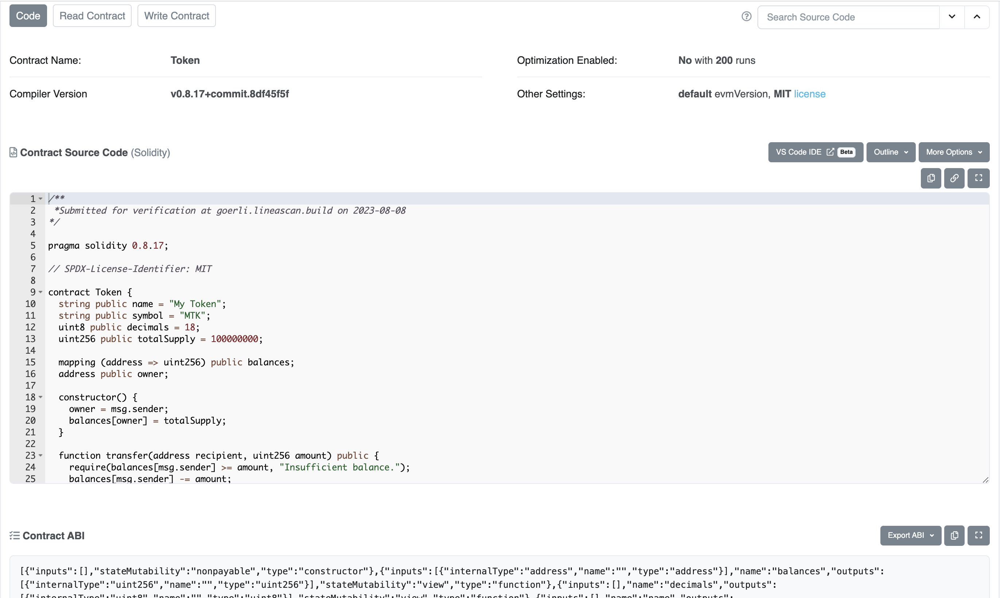

To verify your contracts, you can use Truffle's verification plugin [truffle-plugin-verify](https://github.com/rkalis/truffle-plugin-verify).

These steps assume you stored your secret keys in a `.env` file, which you can read more about [here](./../deploy-smart-contract/truffle.mdx/#truffle-configjs).

## Download the plugin

In your Truffle project, install the plugin:

```bash
npm install -D truffle-plugin-verify
```

Add the plugin to the `truffle-config.js` file:

```javascript
module.exports = {
  /* ... rest of truffle-config */

  plugins: ["truffle-plugin-verify"],
};
```

## Add your Lineascan API Key

Then, you'll need to get an Lineascan (Linea instance of Etherscan) key by creating an account at [https://lineascan.build/myapikey](https://lineascan.build/myapikey). Grab your key, and add it to the `.env` file:

```
MNEMONIC=YOUR_MNEMONIC_HERE
LINEASCAN_API_KEY=YOUR_API_KEY_HERE
```

## Add the custom chain

We'll need to add a custom chain:

import Tabs from '@theme/Tabs'; import TabItem from '@theme/TabItem';

<Tabs className="my-tabs">
  <TabItem value="Mainnet" label="Mainnet" default>

```javascript
require("dotenv").config();
const { MNEMONIC, LINEASCAN_API_KEY } = process.env;
// ... rest of truffle-config
module.exports = {
  networks: {
    linea_mainnet: {
      provider: () => {
        return new HDWalletProvider(
          MNEMONIC,
          `https://rpc.goerli.linea.build/`,
        );
      },
      verify: {
        apiUrl: "https://api.lineascan.build/api",
        apiKey: LINEASCAN_API_KEY,
        explorerUrl: "https://lineascan.build/address",
      },
      network_id: "59144",
    },
  },
  // ... rest of truffle-config
};
```
  </TabItem>
  <TabItem value="Testnet" label="Testnet" default>

```javascript
require("dotenv").config();
const { MNEMONIC, LINEASCAN_API_KEY } = process.env;
// ... rest of truffle-config
module.exports = {
  networks: {
    linea_testnet: {
      provider: () => {
        return new HDWalletProvider(
          MNEMONIC,
          `https://rpc.linea.build/`,
        );
      },
      verify: {
        apiUrl: "https://api-testnet.lineascan.build/api",
        apiKey: LINEASCAN_API_KEY,
        explorerUrl: "https://goerli.lineascan.build/address",
      },
      network_id: "59140",
    },
  },
  // ... rest of truffle-config
};
```

  </TabItem>
</Tabs>

## Verify the smart contract

Run the following to verify the most recently deployed contract:

<Tabs className="my-tabs">
  <TabItem value="Mainnet" label="Mainnet" default>

```bash
truffle run verify <DEPLOYED_CONTRACT_NAME> --network linea_mainnet
```

Alternatively, verify a contract at a specific address:

```bash
truffle run verify <DEPLOYED_CONTRACT_NAME>@<ADDRESS> --network linea_mainnet
```

Your output should be similar to the following:

```bash
Verifying contracts on lineascan
   Verifying Token
   Pass - Verified: https://lineascan.build/address/<CONTRACT_ADDRESS>#code
   Successfully verified 1 contract(s).
Verifying contracts on sourcify
   Sourcify has no support for network linea_mainnet with chain id 59144
```

  </TabItem>
  <TabItem value="Testnet" label="Testnet" default>

```bash
truffle run verify <DEPLOYED_CONTRACT_NAME> --network linea_testnet
```

Alternatively, verify a contract at a specific address:

```bash
truffle run verify <DEPLOYED_CONTRACT_NAME>@<ADDRESS> --network linea_testnet
```

Your output should be similar to the following:

```bash
Verifying contracts on lineascan
   Verifying Token
   Pass - Verified: https://goerli.lineascan.build/address/<CONTRACT_ADDRESS>#code
   Successfully verified 1 contract(s).
Verifying contracts on sourcify
   Sourcify has no support for network linea_mainnet with chain id 59140
```

  </TabItem>
</Tabs>

You can check that it was verified correctly by navigating to the [block explorer](https://lineascan.build/) and pasting in the deployed contract address.


